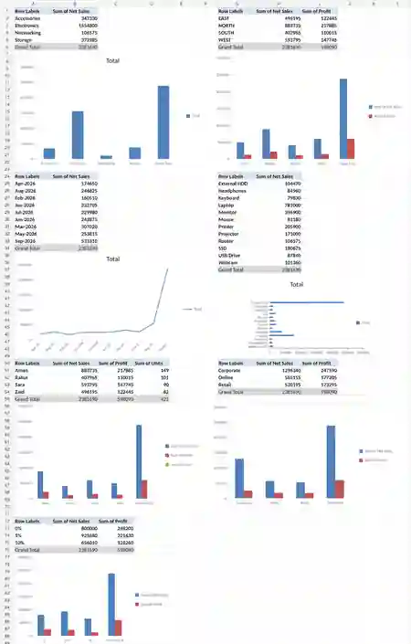
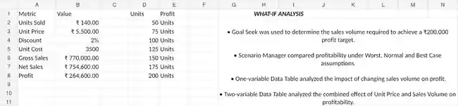

# 🛍️ Retail Sales & Profit Analytics

An Excel-based retail analytics project focused on turning transaction-level sales data into a management-ready performance dashboard.

## Project Goal

Analyze retail performance across products, categories, sales, cost and profit so business users can quickly identify strong and weak areas and evaluate possible scenarios.

## What This Project Demonstrates

- Sales and profit analysis
- KPI design
- Pivot Table reporting
- Dashboard creation
- Scenario / What-If Analysis
- Business-focused interpretation of results

## Project Assets

- `data/retail_sales_data.csv` — source retail dataset
- `screenshots/dashboard.webp` — final dashboard
- `screenshots/pivot_analysis.webp` — Pivot Table analysis
- `screenshots/what_if_analysis.webp` — What-If Analysis output
- `docs/project_summary.md` — detailed project write-up
- `docs/project_summary.pdf` — presentation-ready summary
- `docs/resume_entry.txt` — resume-ready project description
- `docs/linkedin_post.txt` — LinkedIn-ready project post

## Dashboard Preview

## Pivot Analysis

## What-If Analysis

## Skills Used

Excel, Pivot Tables, Pivot Charts, KPI analysis, dashboard design, scenario analysis, data cleaning, business analysis and data storytelling.

## Portfolio Value

This project demonstrates the complete analyst workflow: starting from raw sales data, building structured analysis, creating decision-focused visuals and documenting actionable business findings.
