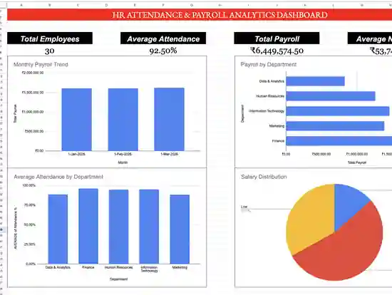

# 👥 HR Attendance & Payroll Analytics

A workforce analytics project that connects employee master data, monthly attendance and payroll calculations into a management-ready HR dashboard.

## Business Problem

HR teams need a clear way to monitor employee attendance, payroll cost, overtime and salary patterns without manually combining multiple sheets every month. This project builds a linked spreadsheet model that automates those calculations and summarizes the results through KPIs, Pivot Tables and charts.

## Dataset Structure

The project uses three connected datasets:

- `Employee_Data` — 30 employees with department, role, location, salary, performance and status
- `Attendance_Data` — 120 monthly attendance records covering January–April 2026
- `Payroll_Data` — 120 monthly payroll records combining employee and attendance information

Employee ID acts as the primary linking key across sheets, while payroll uses both Employee ID and Date for month-specific calculations.

## Core Spreadsheet Logic

Key techniques used include:

- `XLOOKUP` for employee name, department, salary and performance rating
- `SUMIFS` for month-specific overtime retrieval
- `IF` / `IFS` for bonus, tax and salary-status rules
- `COUNTIF`, `AVERAGEIF`, `SUM`, `AVERAGE`, `MAX` and `MIN`
- percentage calculations and conditional formatting
- Pivot Tables for department and monthly analysis
- charts and KPI cards for dashboard reporting

## Key KPIs

| KPI | Result |
|---|---:|
| Total Employees | 30 |
| Average Attendance | 92.50% |
| Total Payroll | ₹6,449,574.50 |
| Average Net Salary | ₹53,746.45 |

## Department Insights

| Department | Total Payroll | Avg. Net Salary | Avg. Attendance |
|---|---:|---:|---:|
| Data & Analytics | ₹825,750.00 | ₹34,406.25 | 88.52% |
| Finance | ₹1,517,994.00 | ₹63,249.75 | 96.10% |
| Human Resources | ₹1,261,382.50 | ₹52,557.60 | 94.55% |
| Information Technology | ₹1,458,065.00 | ₹60,752.71 | 94.94% |
| Marketing | ₹1,386,383.00 | ₹57,765.96 | 88.37% |

### Main Findings

- **Finance has the highest payroll cost** at ₹1.52M and also the highest average net salary.
- **Finance records the strongest average attendance** at 96.10%.
- **Data & Analytics has the lowest average net salary** among the five departments.
- **Marketing and Data & Analytics have the lowest average attendance**, both below 89%.
- Monthly payroll remains very stable across the four-month period, with **March 2026 highest at ₹1,619,183.00**.

## Monthly Payroll

| Month | Total Payroll |
|---|---:|
| Jan 2026 | ₹1,611,700.50 |
| Feb 2026 | ₹1,606,063.00 |
| Mar 2026 | ₹1,619,183.00 |
| Apr 2026 | ₹1,612,628.00 |

## Dashboard Preview



## Pivot Analysis Preview


## Repository Files

```text
02-HR-Attendance-Payroll-Analytics/
├── README.md
├── data/
│   ├── employee_data.csv
│   ├── attendance_data.csv
│   └── payroll_data.csv
└── screenshots/
    ├── dashboard.webp
    └── pivot_analysis.webp
```

## Business Recommendations

1. Review attendance patterns in **Data & Analytics** and **Marketing**, where attendance is materially below the other departments.
2. Track whether Finance's higher salary cost is aligned with role seniority, performance and business contribution.
3. Continue monthly payroll trend monitoring because the overall payroll base is stable; unusual future spikes should therefore be easy to detect.
4. Use the model as a reusable monthly HR reporting template by appending future attendance and payroll records.

## Portfolio Value

This project demonstrates the ability to build a linked HR analytics model from raw employee and attendance data, automate payroll calculations, validate outputs with Pivot Tables and communicate findings through a concise executive dashboard.
